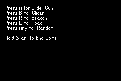

# Conway's "Game of Life" for the Gameboy Advance
Two versions of Conway's "Game of Life" in C++ that can run on the GBA. Both versions utilize the GBA's bitmap mode and page-flipping to recreate this popular cellular automaton.

[My Youtube Channel](https://www.youtube.com/@StartFliing)

## GBA Resources
Here are some resources I used/am using to learn about the GBA
- [devkitPro](https://devkitpro.org/)
- [Tonc](https://gbadev.net/tonc/foreword.html)
- [gbadev](https://gbadev.net/)

## Foreword
THIS IS NOT THE BEST C++ CODE EVER. IT IS FAR FROM PERFECT. THIS IS INTENDED AS A PROOF OF CONCEPT, RATHER THAN A FINAL PRODUCT. PLEASE TAKE THIS INTO CONSIDERATION!

I love feedback, criticisms, suggestions, comments, concerns, PRs, issues, and things of that nature.

I really reccomend using the `no$gba` emulator specifically for it's debugging tools. Extremely helpful for seeing tilesets and maps in the VRAM viewer while a game is running. It can be daunting at first, but I encourage you to explore some of it's other functionalities and tools as well.

I also have used a Windows machine for the development of this project. There might be differences for building this project on a Mac or Linux that I am not familiar with.

### Makefile

Important environment variables to set.

- DEVKITARM — path to devkitARM installation
- DEVKITPRO — path to devkitPro

In addition to `make` and `make clean`, I've added two custom options for `make`;

- `make pad` will pad the gba file to the nearest 4kb which might help if flashing the file to a GBA cart
- `make full` will run `make clean`, `make`, and then `make pad` in a row for a "full build" of the projects 

## User Interface
When running both simulations, they begin with a selection menu for the initial state of the simulation. Use A, B, L, and R to choose a hard-coded pattern to start with, or use any other button to generate a random state. When the simulation is running, you can hold the start button to stop the simulation and return to the selection menu.

Below is a screenshot of the menu as seen on the emulator/hardware:

## mode4-gol-naive
This version uses 1 pixel per cell, and has a 1 pixel border to keep the simulation within the bounds of the screen, resulting in 37,604 cells in total to process for each generation. There are a few drawbacks to this approach. Firstly, it runs quite slow. 37,604 cells is a lot of computation and pushes the gba to its extremes. Secondly, patterns are pretty hard to identify with such a small display.

## mode4-gol
This version addresses the problems of the previous version by using 2x2 pixel cells instead. Performance increases significantly, resulting in much faster simulations (fyi, it's still kinda slow). Visibility is also significantly better, especially on hardware.